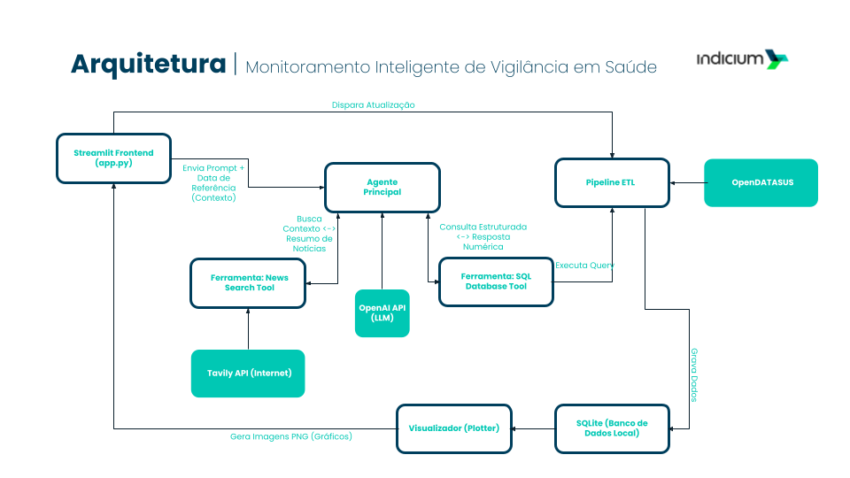

# Monitor de Vigilância Epidemiológica SRAG com Agentes de IA

> **Solução de Inteligência Híbrida:** Pipeline ETL automatizado, orquestração cognitiva com LangGraph e análise de dados multimodal para vigilância da Síndrome Respiratória Aguda Grave (SRAG).

Este projeto implementa um sistema que transforma dados brutos do OpenDataSUS em inteligência acionável. Ele combina engenharia de dados, agentes de IA autônomos e uma interface interativa para apoiar a tomada de decisão em saúde pública.

---

## 🎯 Visão Geral do Projeto

O monitoramento de surtos epidêmicos exige velocidade e precisão. Este projeto resolve o desafio de integrar dados históricos (estruturados) com o contexto atual de notícias (não estruturados) através de uma arquitetura em 4 camadas:

1. **Camada de Dados (ETL Automatizado):** Pipeline que baixa, sanitiza e padroniza dados do OpenDataSUS, criando um *Data Warehouse* local otimizado (SQLite).
2. **Camada Cognitiva (Agente ReAct):** Um agente autônomo baseado em LangGraph que "pensa" e decide quais ferramentas usar para responder a perguntas complexas.
3. **Camada de Ferramentas (Habilidades):**
* **SQL Tool:** Capacidade de executar consultas analíticas complexas no banco de dados.
* **RAG Híbrido:** Sistema de busca que combina vetores (FAISS) e palavras-chave (BM25) para encontrar notícias relevantes na web via Tavily API.
4. **Camada de Apresentação:** Interface Streamlit que orquestra todo o fluxo e apresenta relatórios técnicos e dashboards visuais.

---

## 🚀 Funcionalidades Principais

* **Arquitetura "Token-Efficient":** Estratégia de engenharia de prompt e schema de banco de dados otimizado.
* **Orquestração (Loop):** Uso do LangGraph para permitir que o agente refine suas buscas e corrija erros autonomamente antes de gerar a resposta final.
* **Visualização:** Geração de gráficos de tendência (Matplotlib/Seaborn) integrados ao relatório.

---

## 🏗️ Arquitetura da Solução

A solução segue uma arquitetura modular conforme descrito a seguir:



### 1. Pipeline de Dados (ETL)

Localizado em `src/etl/`. Responsável por:

* **Downloader:** Baixa arquivos Parquet/CSV de múltiplas fontes (anos 2023-2025).
* **Processor:** Aplica regras de negócio, traduz códigos (ex: `1` -> `Cura`) e filtra colunas para otimizar o contexto da IA.
* **Loader:** Persiste os dados limpos em um banco SQLite (`data/srag_data.db`).

### 2. Núcleo de Inteligência (Brain)

Localizado em `src/intelligence/`. Implementa:

* **Graph:** O grafo de estado que define o fluxo de pensamento do agente (Raciocínio -> Ação -> Observação).
* **Tools:** Ferramentas customizadas que dão "superpoderes" ao modelo de linguagem.

### 3. Visualização e Interface

* **Plotter:** Gera imagens estáticas para análise visual (`src/visualization/`).
* **App:** O ponto de entrada do usuário (`app.py`), construído em Streamlit.

---

## 🛠️ Tech Stack

| Componente | Tecnologia | Propósito |
| --- | --- | --- |
| **Orquestração de Agente** | **LangChain & LangGraph** | Gerenciamento de estado, memória e fluxo cíclico de decisão. |
| **LLM (Cérebro)** | **OpenAI GPT-4o** | Modelo principal para raciocínio estratégico e síntese de relatório. |
| **LLM (Ferramentas)** | **OpenAI GPT-4o-mini** | Modelo otimizado para tarefas específicas (geração de SQL) visando economia. |
| **Banco de Dados** | **SQLite** | Armazenamento local leve e performático para dados analíticos. |
| **Busca & RAG** | **Tavily API & FAISS** | Recuperação de informações em tempo real na web e busca semântica. |
| **Engenharia de Dados** | **Pandas & PyArrow** | Manipulação eficiente de grandes volumes de dados (ETL). |
| **Interface** | **Streamlit** | Frontend interativo para acionamento e visualização. |

---

## 📂 Estrutura do Projeto

```text
.
├── .env.example              # Template de variáveis de ambiente
├── .gitignore                # Arquivos ignorados pelo Git
├── app.py                    # Aplicação Principal (Frontend)
├── requirements.txt          # Dependências do projeto
├── README.md                 # Documentação
│
├── config/                   # Configurações Globais
│   ├── settings.py           # Gerenciamento de caminhos e chaves
│   └── prompts.py            # Engenharia de Prompts (System Messages)
│
├── data/                     # Armazenamento Local
│   ├── srag_data.db          # Banco de dados SQLite gerado
│   └── dicionario_dados.json # Metadados para tradução de colunas
│
├── img/                      # Saída de Gráficos Gerados
│
└── src/                      # Código Fonte Modular
    ├── etl/                  # Camada de Engenharia de Dados
    │   ├── downloader.py     # Coleta de dados
    │   ├── processor.py      # Limpeza e transformação
    │   └── pipeline.py       # Orquestrador do ETL
    │
    ├── intelligence/         # Camada de IA (Agentes)
    │   ├── graph.py          # Grafo de decisão (LangGraph)
    │   ├── tools.py          # Ferramentas (SQL, RAG)
    │   └── state.py          # Definição de estado do agente
    │
    └── visualization/        # Camada Visual
        └── plotter.py        # Geração de gráficos estatísticos

```

---

## 🚀 Como Executar

### Pré-requisitos

* Python 3.10 ou superior
* Conta na OpenAI (API Key)
* Conta na Tavily (API Key)

### Passo a Passo

1. **Clone o repositório:**
```bash
git clone https://github.com/jorgefigueirajr/monitor-srag-ai.git
cd monitor-srag-ai

```


2. **Crie e ative o ambiente virtual:**
```bash
# Windows
python -m venv venv
.\venv\Scripts\activate

# Linux/Mac
python3 -m venv venv
source venv/bin/activate

```


3. **Instale as dependências:**
```bash
pip install -r requirements.txt

```


4. **Configure as Chaves de API:**
* Renomeie o arquivo `.env.example` para `.env`.
* Insira suas chaves no arquivo `.env`:
```ini
OPENAI_API_KEY="sk-..."
TAVILY_API_KEY="tvly-..."

```


5. **Execute a Aplicação:**
```bash
streamlit run app.py

```


Acesse a URL exibida no terminal (geralmente `http://localhost:8501`).

---

## 🧠 Como Funciona a Análise (Sob o Capô)

Ao clicar em **"Iniciar Análise Completa"**, o sistema executa:

1. **Sincronização de Dados:** O `pipeline.py` verifica se o banco de dados está atualizado. Se não, baixa os dados mais recentes do governo.
2. **Visualização:** O `plotter.py` gera gráficos atualizados da situação epidemiológica.
3. **Injeção de Contexto:** O sistema lê a data mais recente disponível no banco e injeta no prompt do agente (evitando que ele "pense" que hoje é outra data).
4. **Ciclo de Inteligência:**
* O Agente recebe a missão.
* Decide consultar o banco via SQL para obter números exatos (Casos, Óbitos, UTI).
* Decide pesquisar na web notícias sobre surtos recentes para explicar os números.
* Cruza as informações e escreve o relatório final.
